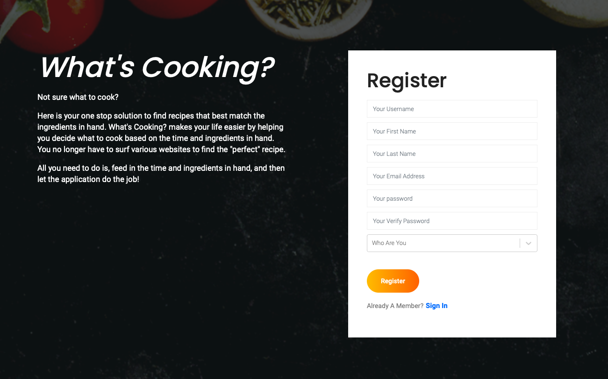
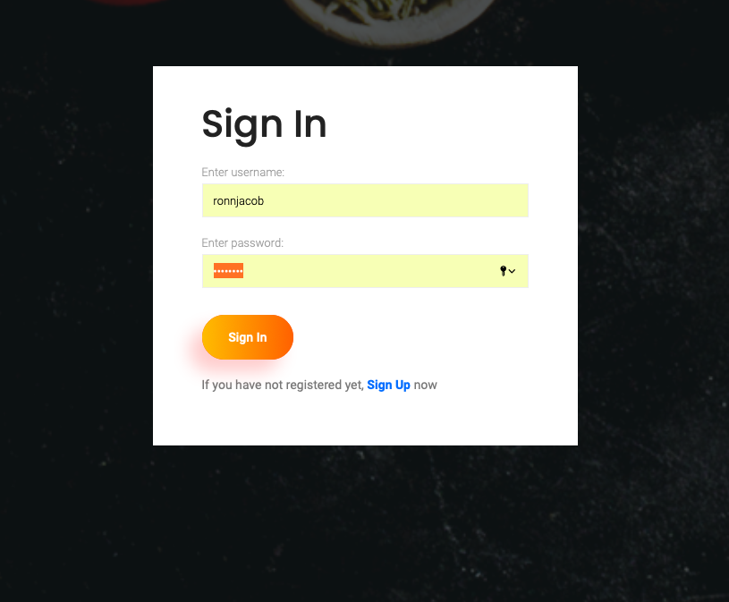
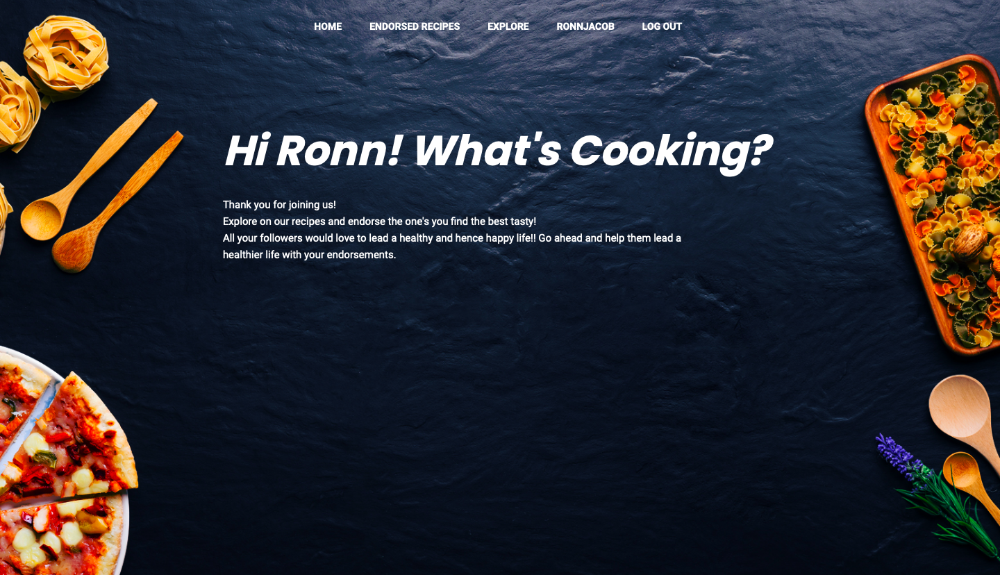
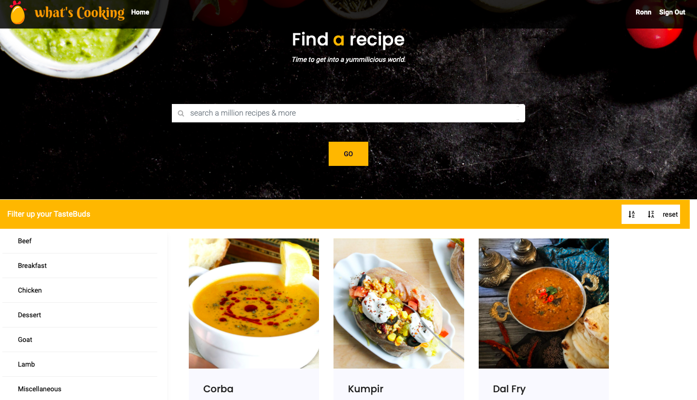
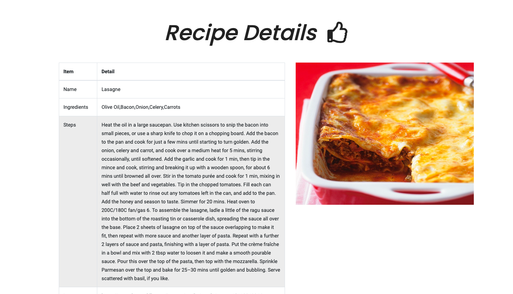
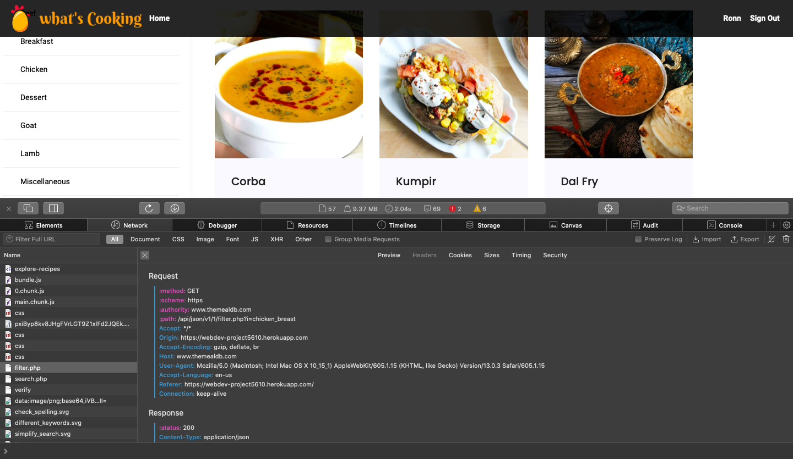

# What's Cooking! 

This is an application build using the MERN stack which uses ReactJS as the frontend framework, Express as the backend framework, MongoDB as the database, and Node.js as the middleware.

* This website would allow a user can register to the application and search for recipes.

 

* The website allows the user to pick a particular user role which gives certain user roles certain privileges such as add/remove or even endorse a recipe (if you've registered as a nutritionist). 

     

* All of these operations are carried out with the help of RESTful web services which have been implemented using Node.js and Mongoose.

